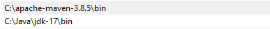
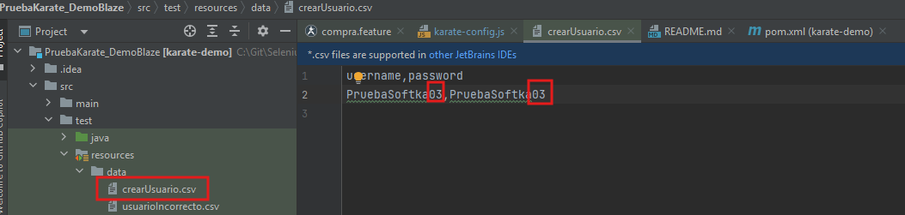
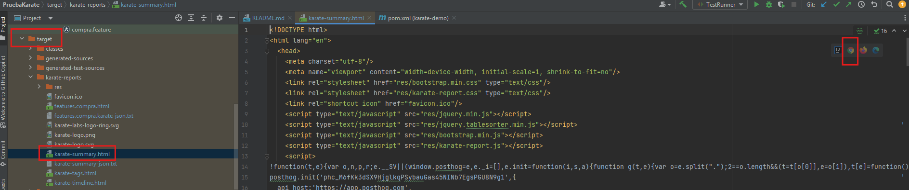
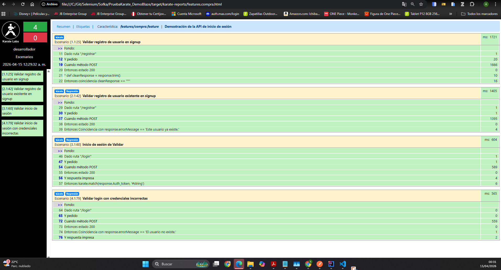

#  DEMOBLAZE (Karate)


## 📌 Descripción del ejercicio

Este repositorio contiene pruebas de servicios REST sobre la API de DEMOBLAZE. Proyecto de automatización de pruebas de APIs utilizando Karate, Maven y JUnit 5, con soporte para:

\- Ejecución por ambientes "dev" (karate-config.js)

\- Filtrado por tags

\- Data-driven con archivos externos (CSV)

\- Ejecución vía TestRunner


Se utilizó \*\*Karate\*\* como herramienta principal para la automatización de pruebas.


## El objetivo es realizar las siguientes pruebas:

• Crear un nuevo usuario en signup

• Intentar crear un usuario ya existente

• Usuario y password correcto en login

• Usuario y password incorrecto en login

## ⚙️ Requisitos Para ejecutar las pruebas

\- Java 17

\- Maven 3.8.5

\- IntelliJ IDEA 

\- Git

\- Conexión a Internet (para consumir la API pública)

\- Instalar el plugin de Karate en IntelliJ IDEA (File > Settings > Plugins > Marketplace > Buscar "Karate" > Instalar)

## ⚙️ Configurar variables de entorno

\- JAVA_HOME

\- M2_HOME


Asimismo en el Path



---

## 🧪 Cómo ejecutar las pruebas

Primero: Clonar el repositorio en tu maquina local

_**Segundo: Modificar la data de prueba en el archivo "src/test/resources/data/crearUsuario.csv" para crear un nuevo usuario con datos únicos. (De no hacerlo generar un error debido a que el usuario ya existe)**_



Tercero: Ejecutar de 2 opciones :

Ir a "src/test/java/runners/TestRunner.java" y ejecutar la clase TestRunner como una prueba JUnit.

O ejecutar el siguiente comando maven en la terminal desde la raíz del proyecto:
```
mvn test -Dtest=TestRunner
```


## 📌 Reporte

Karate brinda el reporte en el log de la consola, asimismo, se puede buscar en la ruata \*\*target/karate-reports/karate-summary.html\*\*
Abrir con un navegador para visualizar el reporte completo.


reporte


Creado por: Alexis Alayo


